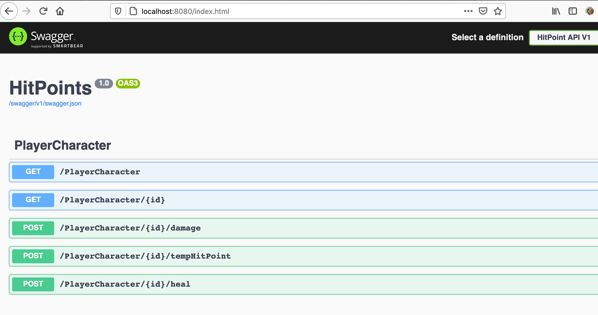

# CSharpHitPoints
A Simple C# DotNetCore API for managing Hit Points on a D&D 5e Character. It should work on any platform that can run DotNetCore (i.e. MacOS, Linux, or Windows)

The API can be run directly from the command line using dotnet the standard way:

``` shell
$ cd HitPoints
$ dotnet run
```

Alternately, it can be used from a docker container:

``` shell
$ cd HitPoints
$ docker build . -t hitpoints
$ docker run -p 8080:80 hitpoints
```

The API exposes a Swagger/OpenAPI endpoint at the root context:


Currently the application is only implemented with a single player character, populated from [briv.json](HitPoints/briv.json). The interesting meat of the API is in the damage, heal, and tempHitPoint endpoints. 

To test them out, use the Swagger UI, or when running via Docker:
```
$ curl -s -X GET "http://localhost:8080/PlayerCharacter1" | jq .currentHitPoints
41
$ curl -X POST "http://localhost:8080/PlayerCharacter/1/damage" -H  "Content-Type: application/json" -d '{"amount":10,"type":"slashing"}'
$ curl -s -X GET "http://localhost:8080/PlayerCharacter1" | jq .currentHitPoints
36
$ curl -X POST "http://localhost:8080/PlayerCharacter/1/heal" -H  "Content-Type: application/json" -d '{"amount":10}'
$ curl -s -X GET "http://localhost:8080/PlayerCharacter1" | jq .currentHitPoints
41
$ curl -X POST "http://localhost:8080/PlayerCharacter/1/tempHitPoint" -H  "Content-Type: application/json" -d '{"amount":10}'
$ curl -s -X GET "http://localhost:8080/PlayerCharacter1" | jq .currentHitPoints
51
```
